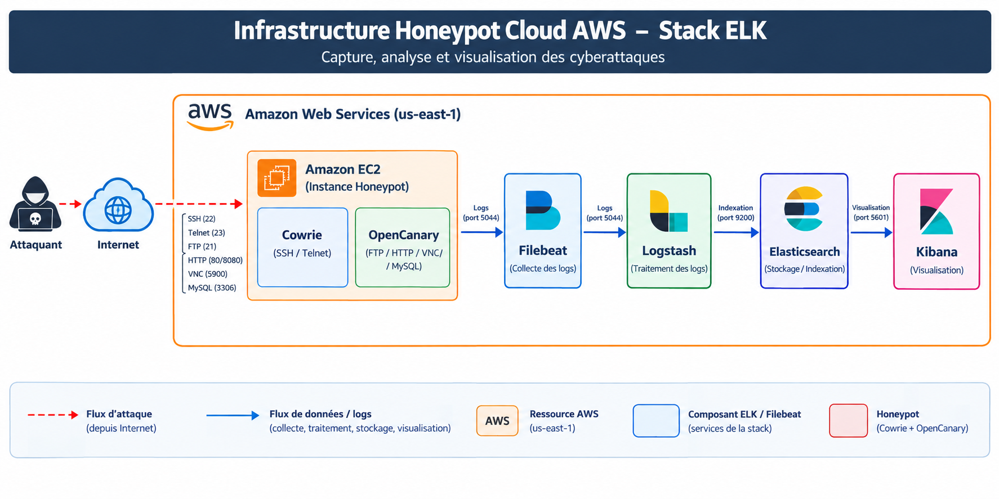

#  Cloud Honeypot – Real-Time Attack Detection

> Deployment of a cloud honeypot on AWS to capture and analyze real-world cyberattacks in real time.

##  Project Objective

Deploy a complete cybersecurity infrastructure on **Amazon Web Services (AWS / us-east-1)**, combining honeypots (Cowrie + OpenCanary) with a centralized platform for collecting, analyzing, and visualizing attack data using the **ELK Stack** (Elasticsearch, Logstash, Kibana) and Filebeat.

##  Architecture

##  Keywords

Honeypot · OpenCanary · Cowrie SSH Honeypot · AWS · Elastic Stack (ELK) · Threat Intelligence · VPC · GeoIP Enrichment · MITRE ATT&CK · Bastion Host · Security Group · Cyber Deception · VirusTotal Lookup

##  Key Results (3 Weeks of Observation — May 2026)

* **796,079** VNC scans detected (most targeted service)
* **133,441** OpenCanary events recorded in a single day (peak on 05/22/2026)
* **9,661** password attempts captured
* **49.53%** of threats classified as **"Reconnaissance"** (MITRE ATT&CK)
* IP **186.10.86.130** confirmed malicious by VirusTotal (14/91 vendors)

##  Repository Structure

| Directory         | Contents                                                              |
| ----------------- | --------------------------------------------------------------------- |
| `docs/`           | Detailed documentation (architecture, honeypots, ELK, visualizations) |
| `scripts/`        | Bash installation scripts for each component                          |
| `configurations/` | Actual configuration files (Cowrie, OpenCanary, ELK, Filebeat)        |
| `lab-setup/`      | AWS deployment documentation (VPC, Security Groups, EC2)              |

##  Quick Start

1. Check `lab-setup/` to recreate the AWS infrastructure (VPC, subnets, Security Groups, EC2 instances)
2. Run the scripts in `scripts/` in numerical order on the corresponding instances
3. Copy the files from `configurations/` to their respective locations
4. Check `docs/06-visualisations-kibana.md` to recreate the dashboards

##  Ethical and Legal Framework

This project was conducted strictly for academic purposes using a personal AWS account. The infrastructure is entirely owned and controlled by the operator. No counterattacks are performed against identified sources. See `docs/08-securite-ethique.md`.

##  References

* [Cowrie Documentation](https://cowrie.readthedocs.io)
* [OpenCanary Documentation](https://opencanary.readthedocs.io)
* [Elastic Stack Documentation](https://www.elastic.co/guide/)
* [MITRE ATT&CK Framework](https://attack.mitre.org)

## 📄 License

Academic Project — ENSA Safi 2025/2026
