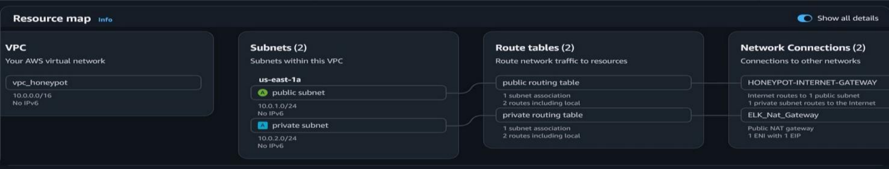
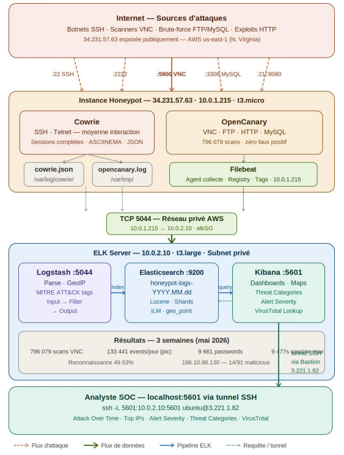

# Architecture de l'Infrastructure AWS

## Vue d'ensemble — VPC vpc_honeypot

L'ensemble de l'infrastructure est déployé dans un VPC dédié nommé `vpc_honeypot` avec le CIDR `10.0.0.0/16`, localisé dans la région **us-east-1 (N. Virginia)**.

*Figure 1 - Resource Map du VPC vpc_honeypot (console AWS)*

## Organisation Réseau

| Composant réseau | Valeur réelle | Rôle |
|---|---|---|
| VPC | vpc_honeypot — 10.0.0.0/16 | Réseau virtuel isolé du projet |
| Subnet Public | public subnet — 10.0.1.0/24 — us-east-1a | Héberge Honeypot + Bastion (exposés) |
| Subnet Privé | private subnet — 10.0.2.0/24 — us-east-1a | Héberge ELK Server (non exposé) |
| Internet Gateway | HONEYPOT-INTERNET-GATEWAY | Accès Internet → subnet public |
| NAT Gateway | ELK_Nat_Gateway (Public NAT, 1 EIP) | Accès Internet sortant → subnet privé |
| Route Table Publique | 2 routes (local + IGW 0.0.0.0/0) | Routage du subnet public vers Internet |
| Route Table Privée | 2 routes (local + NAT 0.0.0.0/0) | Routage du subnet privé via NAT GW |

## Schéma de la chaîne de fonctionnement complète

*Figure 8 - Schéma de la chaîne de fonctionnement complète de l'Elastic Stack dans le projet Honeypot AWS*

**Lecture du schéma :** Zone orange (subnet public 10.0.1.0/24) : les honeypots Cowrie et OpenCanary génèrent des logs sur l'instance 10.0.1.215 ; Filebeat les collecte et les envoie via TCP 5044 vers le serveur ELK. Zone bleue (subnet privé 10.0.2.0/24) : Logstash reçoit, parse et enrichit les événements (GeoIP, MITRE ATT&CK), les indexe dans Elasticsearch, et Kibana les visualise. L'analyste accède à Kibana via un tunnel SSH depuis la Bastion Host, sans jamais exposer le port 5601 sur Interne
