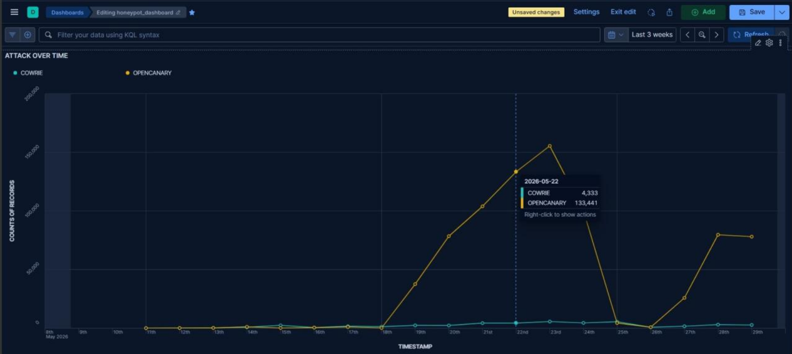
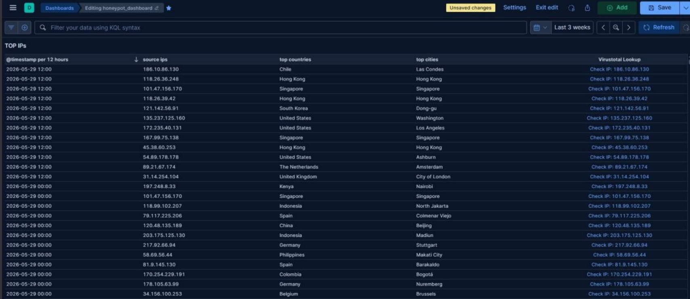
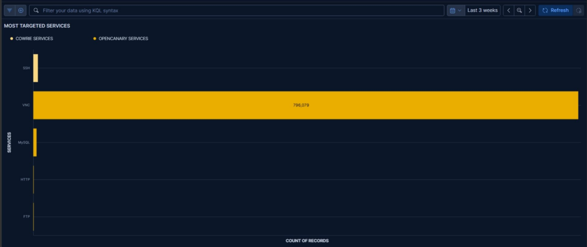
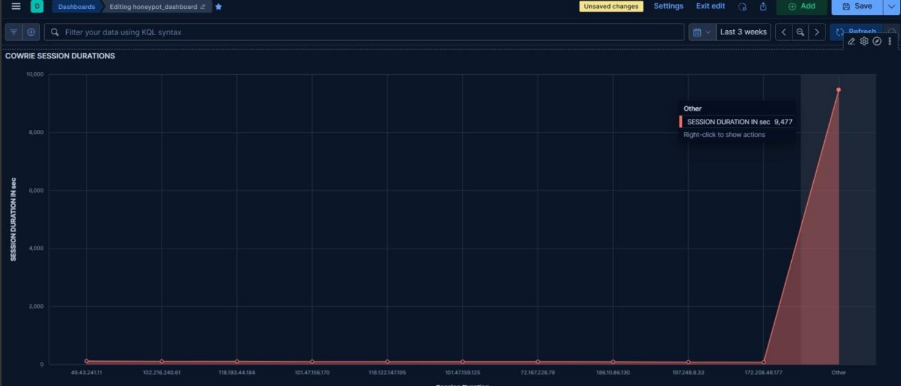
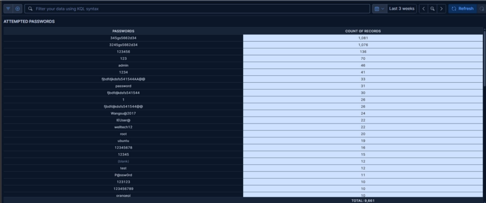
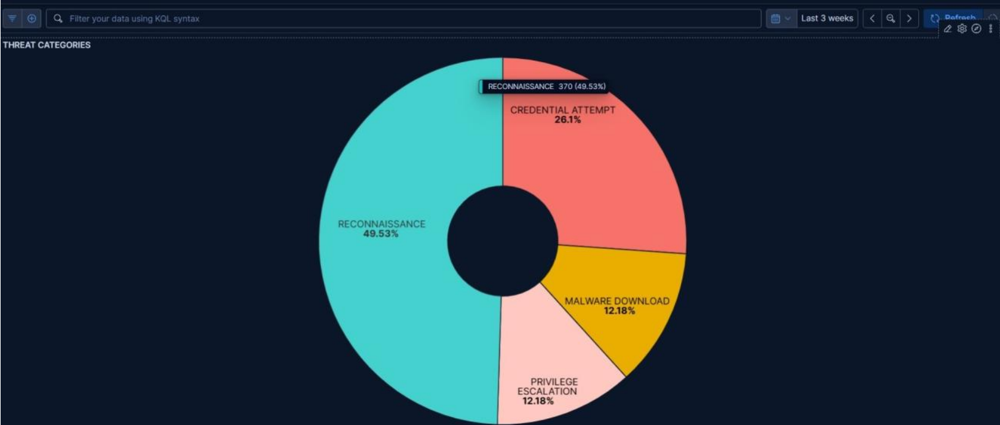
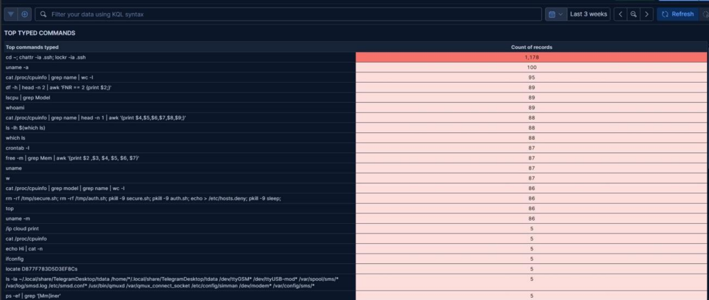
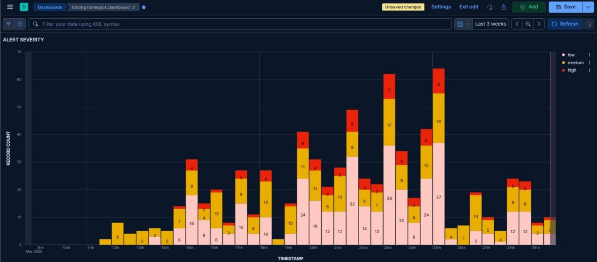
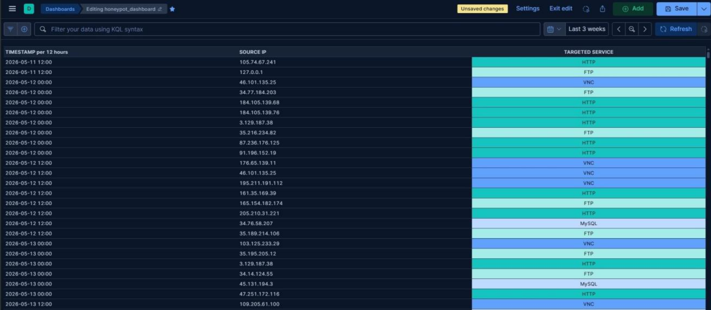
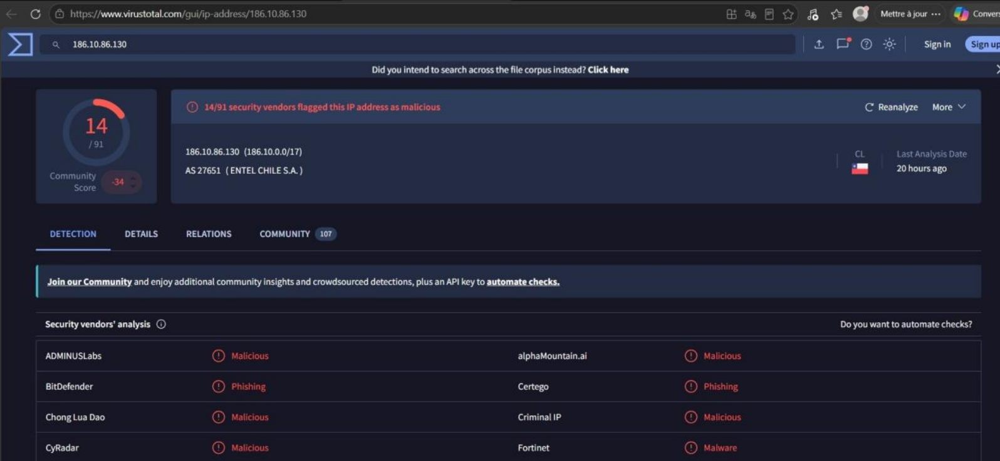

# Visualisations Kibana et Analyse des Attaques

## Dashboard honeypot_dashboard — Vue d'ensemble

Accessible sur `http://localhost:5601` via le tunnel SSH. Couvre 3 semaines d'observation (mai 2026).

## Synthèse des métriques réelles collectées

| Métrique | Valeur | Source |
|---|---|---|
| Pic OpenCanary (22/05/2026) | 133 441 événements/jour | Attack Over Time |
| Total Cowrie (22/05/2026) | 4 333 événements/jour | Attack Over Time |
| Service le plus ciblé | VNC — 796 079 événements | Most Targeted Services |
| Tentatives mots de passe | 9 661 tentatives | Attempted Passwords |
| Catégorie menace dominante | Reconnaissance — 49,53% | Threat Categories |
| Session Cowrie la plus longue | 9 477 secondes (~158 min) | Cowrie Session Durations |
| Top pays sources | Chili, Hong Kong, Singapour, Corée du Sud, USA | Top IPs |
| IP #1 détectée malveillante | 186.10.86.130 (14/91 vendors) | VirusTotal Lookup |

## 1. Attack Over Time (Cowrie vs OpenCanary)

*Pic du 22/05/2026 : 133 441 events OpenCanary, 4 333 Cowrie*

Cowrie reste stable (activité botnet de fond) ; OpenCanary présente une courbe en cloche typique d'une campagne de scan VNC organisée.

## 2. Top IPs Sources avec Géolocalisation

| IP Source | Pays | Ville | Statut VirusTotal |
|---|---|---|---|
| 186.10.86.130 | Chili | Las Condes | Malicious — 14/91 vendors |
| 118.26.36.248 | Hong Kong | Hong Kong | À vérifier |
| 101.47.156.170 | Singapour | Singapour | Réapparaît plusieurs fois |

## 3. Most Targeted Services

*VNC domine avec 796 079 événements — plus de 95% du trafic OpenCanary*

## 4. Cowrie Session Durations

*Session maximale : 9 477 secondes (~158 min) — indique un attaquant humain ou bot sophistiqué*

## 5. Attempted Passwords

| Rang | Mot de passe | Tentatives | Interprétation |
|---|---|---|---|
| 1 | 345gs5662d34 | 1 081 | Dictionnaire botnet personnalisé |
| 2 | 3245gs5662d34 | 1 076 | Variante même campagne |
| 3 | 123456 | 136 | Mot de passe le plus commun |

## 6. Threat Categories

| Catégorie | % | MITRE ATT&CK |
|---|---|---|
| Reconnaissance | 49,53% | T1595 / T1046 |
| Credential Attempt | 26,1% | T1110.001 |
| Malware Download | 12,18% | T1105 |
| Privilege Escalation | 12,18% | T1548 / T1053 |

## 7. Top Typed Commands

Commande la plus exécutée : `cd ~; chattr -ia .ssh; lockr -ia .ssh` (1 178 fois) — persistence SSH.

## 8. Alert Severity

*Pic le 25 mai 2026 : 64 alertes (9 high, 18 medium, 37 low)*

## 9. OpenCanary Events par Service et IP

## 10. VirusTotal Lookup intégré

*IP 186.10.86.130 flaggée malveillante par 14/91 vendors (ADMINUSLabs, BitDefender, Fortinet...) — AS27651 ENTEL CHILE S.A.*

Lien généré dynamiquement dans Kibana vers `https://www.virustotal.com/gui/ip-address/[IP]`.
