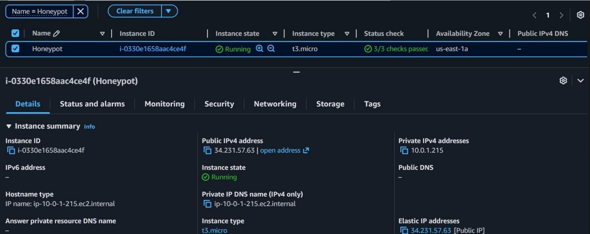
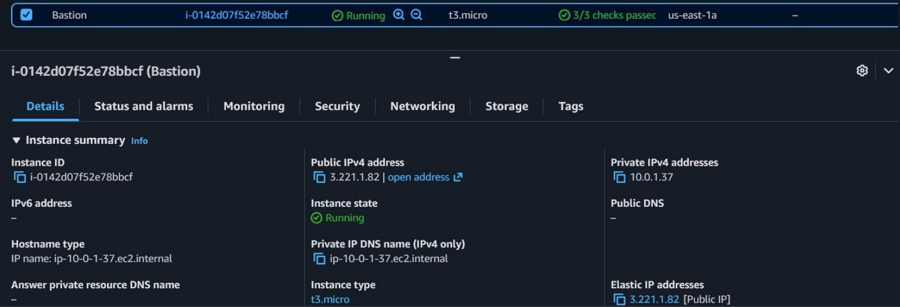
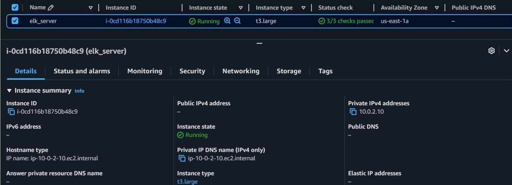

# Instances EC2

## Récapitulatif

| Instance | Type | AMI | Subnet | Rôle |
|---|---|---|---|---|
| Honeypot | t3.micro | Ubuntu Server 22.04 LTS | public | Cowrie + OpenCanary + Filebeat |
| Bastion | t3.micro | Ubuntu Server 22.04 LTS | public | Jump server |
| elk_server | t3.large | Ubuntu Server 22.04 LTS | private | Elasticsearch + Logstash + Kibana |

## Commandes de lancement (exemple CLI)

```bash
# Honeypot
aws ec2 run-instances \
  --image-id ami-xxxxxxxx \
  --instance-type t3.micro \
  --subnet-id <PUBLIC_SUBNET_ID> \
  --security-group-ids <HONEYPOT_SG_ID> \
  --key-name votre-cle \
  --associate-public-ip-address \
  --tag-specifications 'ResourceType=instance,Tags=[{Key=Name,Value=Honeypot}]'

# Bastion
aws ec2 run-instances \
  --image-id ami-xxxxxxxx \
  --instance-type t3.micro \
  --subnet-id <PUBLIC_SUBNET_ID> \
  --security-group-ids <BASTION_SG_ID> \
  --key-name votre-cle \
  --associate-public-ip-address \
  --tag-specifications 'ResourceType=instance,Tags=[{Key=Name,Value=Bastion}]'

# ELK Server (t3.large — 8GB RAM nécessaire pour Elasticsearch)
aws ec2 run-instances \
  --image-id ami-xxxxxxxx \
  --instance-type t3.large \
  --subnet-id <PRIVATE_SUBNET_ID> \
  --security-group-ids <ELK_SG_ID> \
  --key-name votre-cle \
  --tag-specifications 'ResourceType=instance,Tags=[{Key=Name,Value=elk_server}]'
```

## Connexion via Bastion (jump server)

```bash
# Se connecter à la Bastion
ssh -i votre-cle.pem ubuntu@<IP_PUBLIQUE_BASTION>

# Depuis la Bastion, rebondir vers le honeypot (port admin 4422)
ssh -p 4422 ubuntu@10.0.1.215

# Depuis la Bastion, rebondir vers le serveur ELK
ssh ubuntu@10.0.2.10
```




